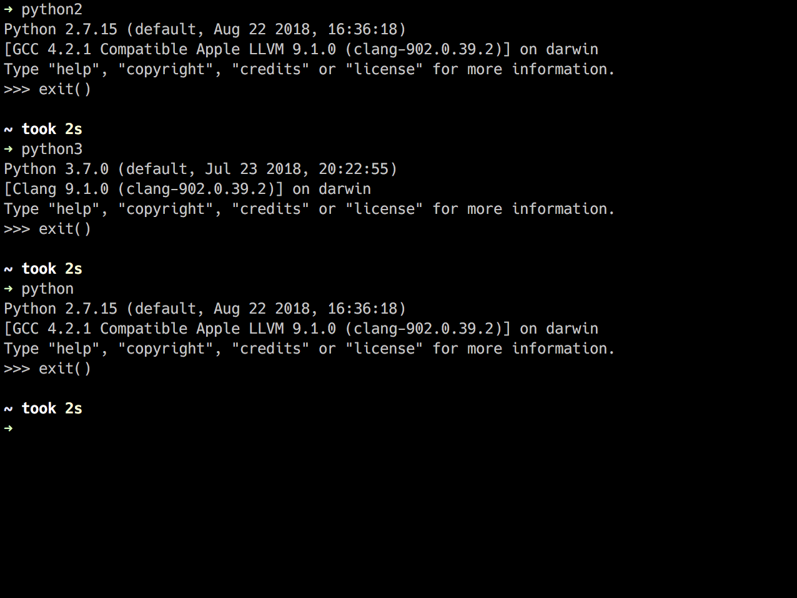

<a href="https://github.com/CyberTrainingUSAF/07-Python-Programming/blob/master/00-Table-of-Contents.md" rel="Return to TOC"> Return to TOC </a>

# Running Python


## Python Interpreter

There are a couple of ways to execute Python code. One way is through the **Python Interpreter,** which allows for on the fly code testing and sandboxing. The Python Interpreter uses a concept called **REPL:**

* **Read** the user input
  * Some constructs like loops might be multiple lines
* **Evaluate** the input
  * Attempt to perform the instruction
* **Print:** to the screen and
  * Print any requested info or an error with stack trace
* **Loop:**
  * Print the next user prompt or loop until evalution complete 

The Python Interpreter can be launched from the command prompt or terminal using the following commands:

#### Linux & OS X

* **python2 or python** generally opens up Python 2
* **python3** generally opens up Python 3 \(will open an out dated Python 3 one some distros\)
* **python3.7** opens up Python 3.7 currently on Fedora
* This is all dependent on a number of factors
* You can create aliases if you wish



#### Windows

* **py -2** generally opens up Python 2
* **py -3** or **py** generally opens up Python 3
* Again, this is all dependent on a number of factors

### Additional Commands/Info

* **exit\(\) or shortcut crtl-D** to exit the Python Interpreter.
* Typing simply a variable or expression will yield a printed output

```python
# >>> represents the interpreter asking for a command. 

>>> x = 100
>>> x
100
>>> x + 5
105
>>> x
100
```

* Conditionals can be checked and loops can be executed. Be sure to provide indentation. This can be done via pressing the space bar 2 or 4 times per line or pressing tab. 

  

## Python Source Files

The other way to run Python code is using source files with the extension of .py. Python does not require compilation on the user's end. Executing .py source code is similar to starting the Interpreter.

**Be sure to:**

* Use appropiate bash commands for the source code's Python version
* Include filename and extension after bash command
* Include any arguments after filename and extension.
* We will go over ways to execute multiple files later in the course.

```text
$ ls
file.txt    fileIO.py    hello_world.py    hello_world_3.py

$ python hello_world.py
Hello World!

$ python3 hello_world_3.py
Hello World for Python 3!
```

<a href="https://github.com/CyberTrainingUSAF/07-Python-Programming/blob/master/00-Table-of-Contents.md" rel="Return to TOC"> Return to TOC </a>
