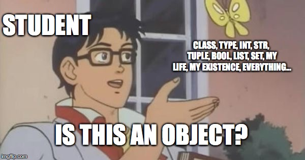

<a href="https://github.com/CyberTrainingUSAF/07-Python-Programming/blob/master/00-Table-of-Contents.md" rel="Return to TOC"> Return to TOC </a>

# Variables



## EVERYTHING IN PYTHON IS AN OBJECT!

This is the single, most important thing I can teach you. The sooner you have an understanding of Python Objects, the quicker everything else falls into place.

**Data types are dynamic based on the variable stored. To check type, use:**

#### **type\(**var**\)**

```python
# python2
x = 10
type(x)
# output: <type 'int'>

# python3
# output: <class 'int'>
```

Notice the output is &lt;**class** 'int'&gt; or &lt;**type** 'int'&gt;.... Type and class are interchangeable for our purposes. There was a time when they wern't. Once again, everything in Python is an object! We will go over type\(\) more in meta-classes.

#### Multiple assignment

Multiple assignment is allowed and types can be the same or different:

```python
# All == 100
a = b = c = 100

# Will only reassign variable c
c = 200

print 'a = {} b = {} c = {}'.format(a, b, c)
# output: a = 100 b = 100 c = 200

# will change all three variables
a,b,c = 100, 'hello', {}
print 'a = {} b = {} c = {}'.format(a, b, c)
#output: a = 100 b = hello c = {}
```

## Data Types

* **Numbers**
  * int, long, float, complex
* **Strings**
* **Lists**
  * Think array
* **Tuples**
  * Think constant array
* **Dictionaries**
  * Think associative array

### Data Types: Immutable

**Immutable objects** are those that can't be changed without reassigning. Such as int or str. **Mutable objects** are those that can be changed. Such as list or dict. Below is a table with all types and their mutability.


## Continue to Lab 2A

<a href="https://github.com/CyberTrainingUSAF/07-Python-Programming/blob/master/00-Table-of-Contents.md" rel="Return to TOC"> Return to TOC </a>
