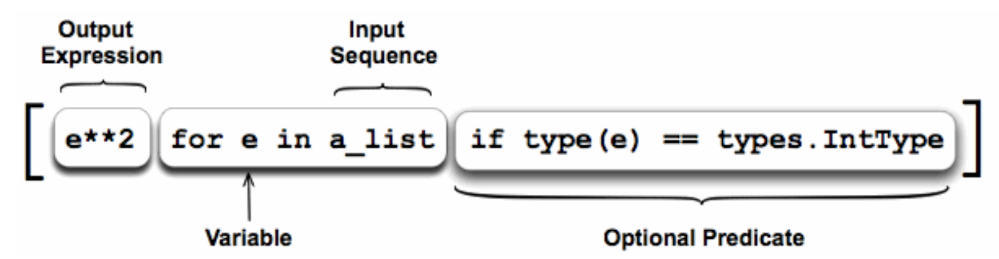

<a href="https://github.com/CyberTrainingUSAF/07-Python-Programming/blob/master/00-Table-of-Contents.md" rel="Return to TOC"> Return to TOC </a>

# List Comprehension

Python supports something called "list comprehension". In short, this allows us to write minimal, easy and readable lists in a way like mathematicans do.



## Steps

Taking a look at the example above, let's break it down into something more understandable.

* First, the _for e in a\_list_ is examined. 
  * **a\_list** is just some var list that is visable within our scope
  * We are going to itterate through this list...
* While itterating through the list, we are going to check the **optional predicate**, _if type\(e\) == types.IntType_ in this case
  * So per itteration, we check that condition. If it's true, we execute the output expression...
  * As per the name, it's opitional. If there is no optional predicate, the output expression simply runs. 
* The **output expression**, _e\_\*2\* in this case, is ran if the opitional predicate exists and is True. 
  * This happens per itteration of a\_list as well. 

**Normal List**

```python
a_list = [1,2,3,4,5]

def square_list(a_list):
    a = []
    for item in a_list:
        a.append(item*item)
    return a

print square_list(a_list)

# Output
[1, 4, 9, 16, 25]
```

**Normal List with Refactoring** 

### \(In this example the a\_list global variable was overwritten. This can be avoided by reassigning the results to a new variable.\)

```python
a_list = [1,2,3,4,5]

def square_list(a_list):
    for i in range(len(a_list)):
        a_list[i] *= a_list[i]

square_list(a_list)
print a_list

# Output
[1, 4, 9, 16, 25]
```

**List Comprehension Without Conditional**

```python
a_list = [1,2,3,4,5]

def square_list(a_list):
    return [x*x for x in a_list]

print square_list(a_list)

#Output 
[1, 4, 9, 16, 25]
```

**List Comprehension With Conditional**

```python
a_list = [1,2,3,4,5]

def square_list(a_list):
    return [x*x for x in a_list if x % 2 == 0]

print square_list(a_list)

# Output
[4, 16]
```

**Set Comprehension With Conditional**

```python
a_list = [1,2,3,4,5]

def square_list(a_list):
    return {x*x for x in a_list if x % 2 == 0}

print square_list(a_list)

# Output
set([16, 4])
```

---

<a href="https://github.com/CyberTrainingUSAF/07-Python-Programming/blob/master/04_functions/05_closures_iterators_generators.md" > Continue to Next Topic </a>
