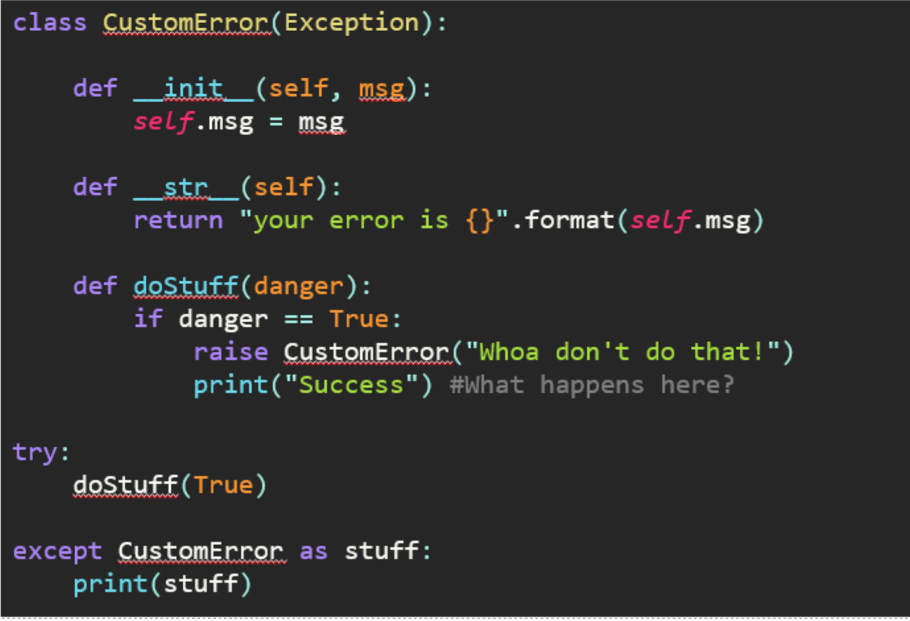

<a href="https://github.com/CyberTrainingUSAF/07-Python-Programming/blob/master/00-Table-of-Contents.md" rel="Return to TOC"> Return to TOC </a># Exceptions

Python exceptions allow you to attempt code that may result in an error and execute additional functionality on said error.

* **Try/except/finally/else**
  * Try statement begins an exception handling block
* **Raise**
  * Triggers exceptions
* **Except**
  * Handles the exception
* **Multiple Exceptions**
  * Handles multiple exceptions

**Example**

```python
try:
    <statements>
except: <name>:
    <statements>
except: <name> as <data>:
    <statements>
else:
    <statements>

try:
    <statements>
finally:
    <statements>
```

**Example 2:**

```python
"""
Checks a certain range of numbers to see if they can divide into a user specified num
"""
# Program main, runs at start of program
def launch():
    num = raw_input('What number would you like to check?')
    amount = raw_input('How many numbers do you want to check?')

    if isInt(num) == False or isInt(amount) == False:
        print "You must enter an integer"
        launch() 
    elif int(amount) < 0 or int(num) < 0:
        print "You must enter a number greater than 0"
        launch() 
    else:
        divisable_by(int(num), int(amount))

# Checks num divisable numbers up to amount or itself
def divisable_by(num, amount):
    i = 1.0
    while (num / i >= 1 and amount > 0):
        if num % i == 0:
            print '{} is divsable by {}'.format(int(num), int(i))
            amount -= 1
        i += 1

# EXCEPTION HANDLING
def isInt(x):
    try:
        int(x) ###
        return True
    except ValueError:
        return False

launch()
```



<a href="https://github.com/CyberTrainingUSAF/07-Python-Programming/blob/master/00-Table-of-Contents.md" rel="Return to TOC"> Return to TOC </a>
