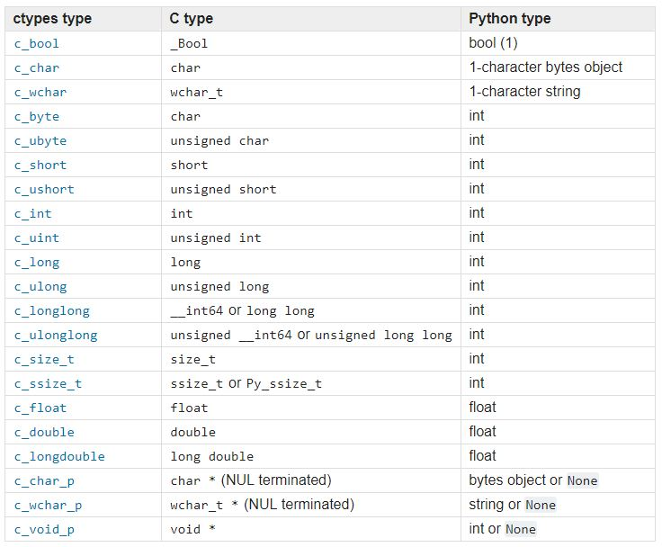

# CTypes and Structures

**CTypes** provide C compatible data types and allow function calls from DLLs or shared libraries without having to write custom C extensions for every operation. So we can access the functionality of a C library from the safety and comfort of the **Python Standard Library.**

_**CTypes are a Foreign Function Interface \(FFI\) library and provide an API for creating C-compatible datatypes.**_

### Reference: [CTypes](https://docs.python.org/2.7/library/ctypes.html)

## Loading Libraries:

There are **four** types of **dynamic library loaders** available in `ctypes` and **two** conventions to use them. The classes that represent dynamic and shared libraries are `ctypes.CDLL`, `ctypes.PyDLL`, `ctypes.OleDLL`, and `ctypes.WinDLL`. The last two are only available on Windows.

Differences between `CDLL` and `PyDLL:`

* `ctypes.CDLL`: This class represents loaded shared libraries. The functions in these libraries use the standard calling convention, and are assumed to return `int`. GIL \(Global Interpreter Lock\) is released during the call. \([More on GIL](https://wiki.python.org/moin/GlobalInterpreterLock)\)
* `ctypes.PyDLL`: This class works like `CDLL`, but GIL is not released during the call. After execution, the Python error flag is checked and an exception is raised if it is set. It is only useful when directly calling functions from the Python/C API.

To load a library, you can either instantiate one of the preceding classes with proper arguments or call the `LoadLibrary()` function from the submodule associated with a specific class:

* `ctypes.cdll.LoadLibrary()` for `ctypes.CDLL`
* `ctypes.pydll.LoadLibrary()` for `ctypes.PyDLL`
* `ctypes.windll.LoadLibrary()` for `ctypes.WinDLL`
* `ctypes.oledll.LoadLibrary()` for `ctypes.OleDLL`

The main challenge when loading shared libraries is how to find them in a portable way. Different systems use different suffixes for shared libraries \(`.dll` on Windows, `.dylib` on OS X, `.so` on Linux\) and search for them in different places. Unfortunately, Windows does not have a predefined naming scheme for libraries.

### Reference: [CType Shared Libraries in Windows](https://docs.python.org/3.5/library/ctypes.html)

Both library loading conventions \(the `LoadLibrary()` function and specific library-type classes\) require you to use the full library name. This means all the predefined library prefixes and suffixes need to be included. For example, to load the C standard library on Linux, you need to write the following:

```text
>>> import ctypes
>>> ctypes.cdll.LoadLibrary('libc.so.6')
<CDLL 'libc.so.6', handle 7f0603e5f000 at 7f0603d4cbd0>
```

Fortunately, the `ctypes.util` submodule provides a `find_library()` function that allows to load a library using its name without any prefixes or suffixes and will work on any system that has a predefined scheme for naming shared libraries:

```text
>>> import ctypes
>>> from ctypes.util import find_library
>>> ctypes.cdll.LoadLibrary(find_library('c'))
<CDLL '/usr/lib/libc.dylib', handle 7fff69b97c98 at 0x101b73ac8>
>>> ctypes.cdll.LoadLibrary(find_library('bz2'))
<CDLL '/usr/lib/libbz2.dylib', handle 10042d170 at 0x101b6ee80>
>>> ctypes.cdll.LoadLibrary(find_library('AGL'))
<CDLL '/System/Library/Frameworks/AGL.framework/AGL', handle 101811610 at 0x101b73a58>

#Linux
```

## Calling C functions using ctypes

When the library is successfully loaded, the common pattern is to store it as a module-level variable with the same name as library. The functions can be accessed as object attributes, so calling them is like calling a Python function from any other imported module:

```text
>>> import ctypes
>>> from ctypes.util import find_library
>>> 
>>> libc = ctypes.cdll.LoadLibrary(find_library('c'))
>>> 
>>> libc.printf(b"Hello world!\n")
Hello world!
```

Unfortunately, all the built-in Python types except integers, strings, and bytes are incompatible with C datatypes and thus must be wrapped in the corresponding classes provided by the `ctypes` module.

## Data Types



As you can see, this table does not contain dedicated types that would reflect any of the Python collections as C arrays. The recommended way to create types for C arrays is to simply use the multiplication operator with the desired basic `ctypes` type:

```text
>>> import ctypes
>>> IntArray5 = ctypes.c_int * 5
>>> c_int_array = IntArray5(1, 2, 3, 4, 5)
>>> FloatArray2 = ctypes.c_float * 2
>>> c_float_array = FloatArray2(0, 3.14)
>>> c_float_array[1]
3.140000104904175
```

## Defining Argument Types and Return Types

If a C library requires arguments to be passed and/or has a return value, it is a good practice to declare them like so:

```python
import ctypes


calc = ctypes.CDLL("MyCalc.dll")
addition = calc.addition()
# Declare return type
addition.restype = ctypes.c_int
# Declare argument types
addition.argtypes = [ctypes.c_int, ctypes.c_int]
# Pass arguments
addition(1,2)
```

## Structures

Creating C Structs in Python can be useful. For instance, let's assume a function within a DLL requires a pointer to a struct to be passed. A real world example of this would be a DLL file that communicates with hardware. Below is an example of how to create a C struct using Python ctypes

```python
import ctypes

# Create the struct
class P_Struct(ctypes.Structure):
    _fields_ = [("field_1", ctypes.c_int),
                ("field_2", ctypes.c_char_p)]

# Pass struct values                 
my_struct = P_Struct(1, "Hello World")
# Create a pointer to my_struct
pointer_my_struct = ctypes.pointer(my_struct)

print my_struct.field_1, my_struct.field_2

# Import the DLL and pass pointer_my_struct to the C function requiring a pointer to a struct.
```

**Output:**

```text
1 Hello World
```

